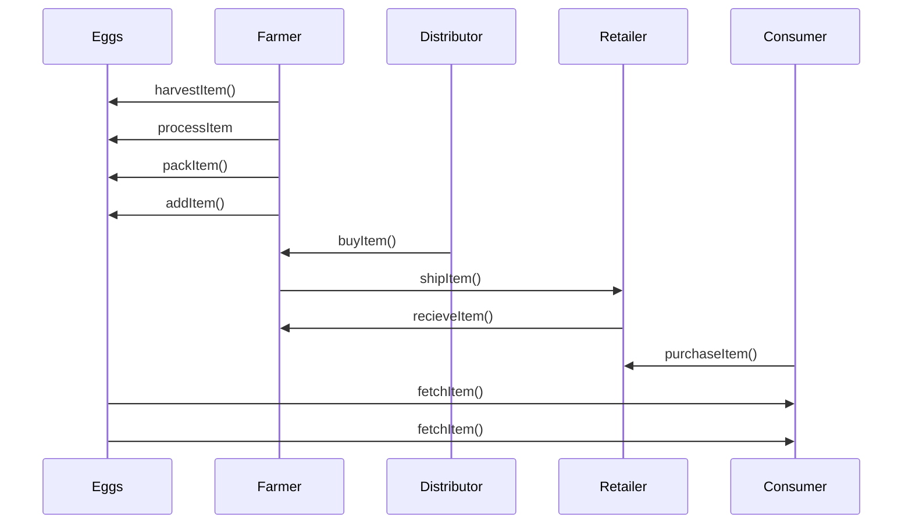

# Egg Supply chain tracking

This project implements supply chain tracking for eggs.
Everything is implemented completely decentralized via Ethereum Smart Contracts and IPFS.

The goal is to allow customers more trust in their purchase. 
In recent years, consumers have become more and more aware of the horrendous conditions in some chicken farms. At the same time, there have been repeated scandals or eggs being wrongfully labeled as organic.

UML diagrams are coded using mermaid.

## 1 . Project Plan

### UML

Here's what the activity diagram looks like

### Libraries
TODO
### IPFS
TODO

## 2. Smart Contracts
### Define and implement interfaces
TODO
### Build out AccessControl Contracts
TODO
### Build out Base Contract
TODO
### Build out Core Contract
TODO

## 3. Tests

## 4. Deployment

